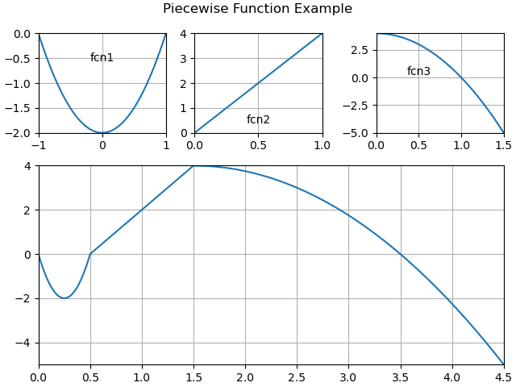

# Piecewise Functions

The piecewise function library was created to simplify the generation
said functions. It provides maximum control to the user when setting up
sub-functions and there are plans to include more than just polynomials.

## License

piecewise-fcn-lib is distributed under the [MIT License](LICENSE.txt).

## Quick Start

```cargo test``` executes the unit test framework but the integration
tests in the ```tests/``` directory are more examples and write their
output to ```tests/output/```. They cover all of the different features
available from this library.

### Installation

Add the following line to your Cargo.toml __dependendies__ section.

piecewise_fcn_lib = { git = "https://github.com/DefinitelyNotMike57/piecewise-fcn-lib", branch="main" }

### Usage

The code segment below is how you would synthesize the piecewise
function shown in the image below.

```rust
let mut fcn = Function::new();
fcn.add_domain(subfcn::Polynomial::new(0.5,vec![-1.0,1.0],vec![-2.0,0.0,2.0],false));
fcn.add_domain(subfcn::Polynomial::new(1.0,vec![0.0,1.0],vec![0.0,4.0],false));
fcn.add_domain(subfcn::Polynomial::new(3.0,vec![0.0,1.5],vec![4.0,0.0,-4.0],false));
```

### Function 1

The equation

is evaluated over the region (-1.0,1.0], is scaled to a range of 0.5,
and is not inverted. This is the first domain of ```fcn```.

### Function 2

The equation

is evaluated over the region (0.0,1.0], is scaled to a range of 1.0,
and is not inverted. This is the second domain of ```fcn```.

### Function 3

The equation

is evaluated over the region (0.0,1.5], is scaled to a range of 3.0,
and is not inverted. This is the third and last domain of ```fcn```.



## More Details

A sub-domain is defined over the range [x<sub>1</sub> --> x<sub>2</sub>)
inclusive of x<sub>1</sub> and exclusive of x<sub>2</sub>. Each
piecewise function is defined over a sub-domain and scaled to the
duration. This was done to enable the user to identify a portion of a
function that is desirble and use it for a particular sub-domain.


